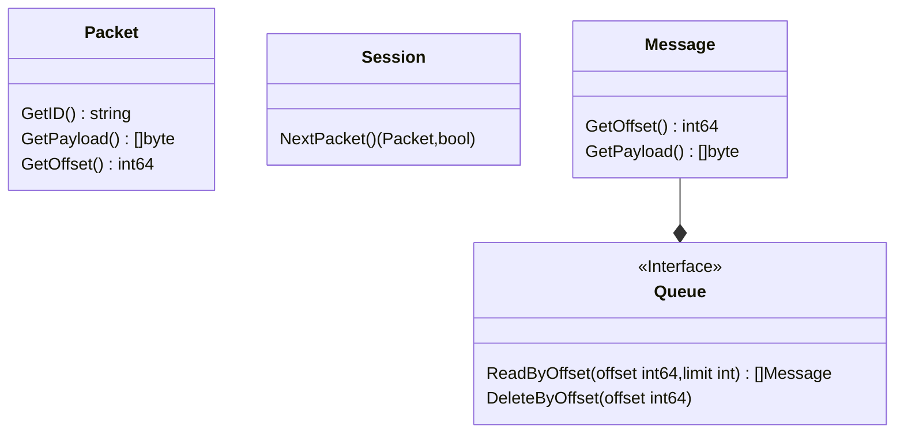

# Profile

A distributed message broker base on mqtt5.0 protocol.

# Broker Structure

```mermaid

```
# Quick Start

# Broker Handler Process

## Connect Handler

```mermaid
sequenceDiagram

Client ->> Broker : request connect

Broker ->> Broker : check protocol & version 

alt set username or password 
Broker ->> Broker : auth username and password
else
end

alt property include auth
Broker ->> Broker : auth with auth data
end

Broker ->> Broker : set keepalive for client


alt flag clean is true 
    Broker ->> Session : clean client's session
    Broker ->> Store : clean store belong client
   
else
    Broker ->> Session : use old session or create new
    Broker ->> Store: try read unack message  or other unfinish task  
end

Broker ->> Session : store property to session

Broker -->> Client : response ack

```

# Store Structure



# API

