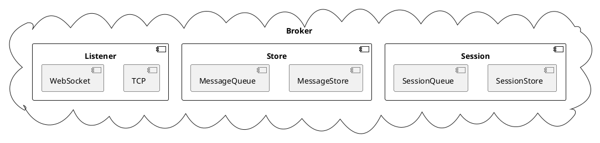
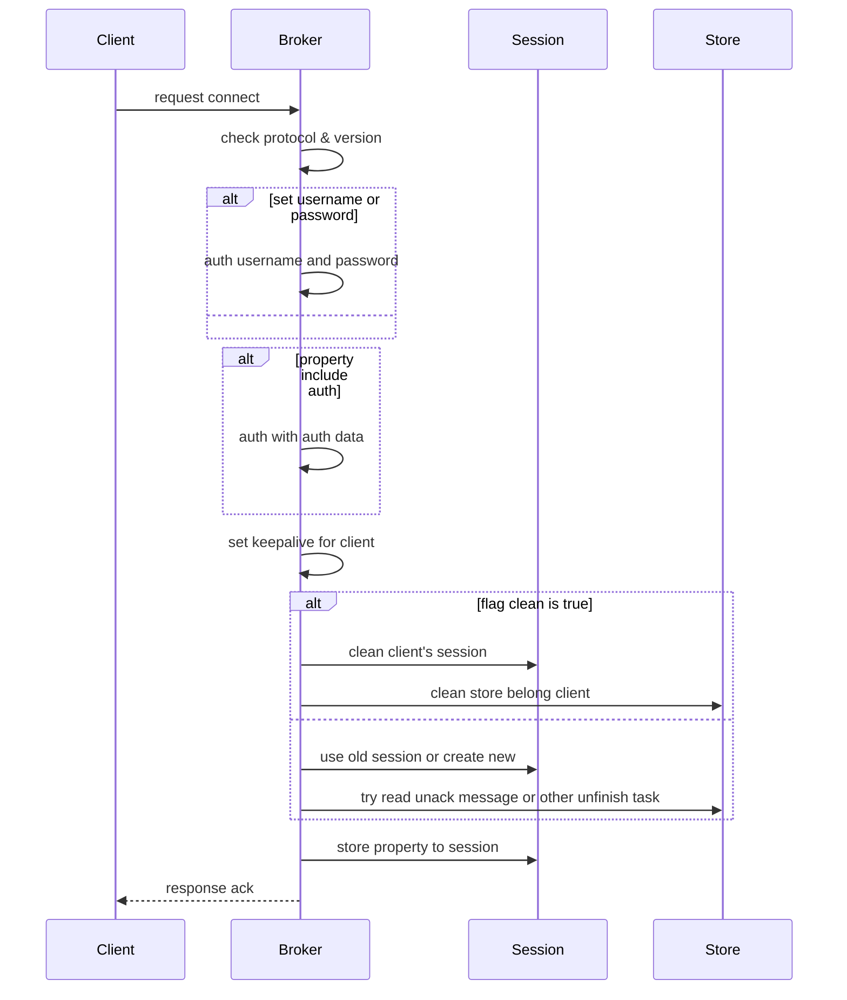
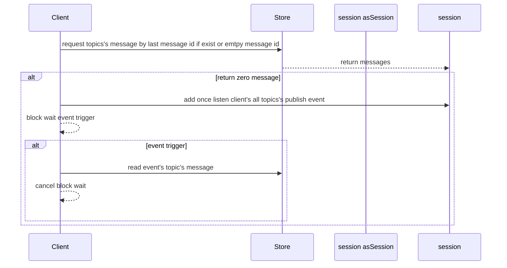
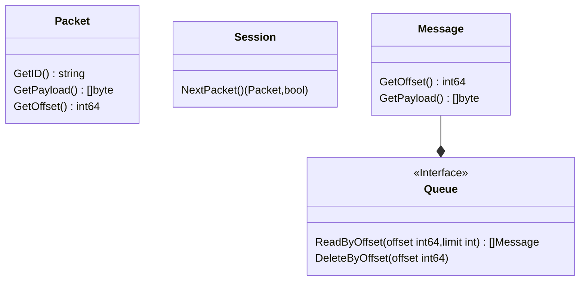

# Profile

A distributed message broker base on mqtt5.0 protocol.

# Broker Structure

## components

### Listener
A distributed listener for client connect. support TCP and WebSocket protocol.
### Session
A distributed session manager for client implement by Raft.
### Store
Store publish messages. Any database implement store interface. support mysql,redis,leveldb and so on.

# Quick Start

# Broker Handler Process

## Connect Handler

# How Client Read Store With Session

# Store Structure

# API

