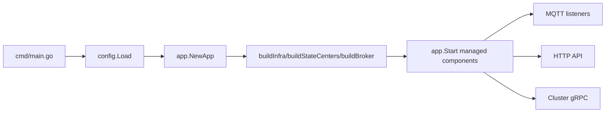

# SkyTree Overview

<!-- maintained-by: human+ai -->
<!-- ai-generated-start -->

## 1. Project Positioning

SkyTree is a distributed MQTT 5 broker written in Go.  
A single process combines MQTT data-plane handling, subscription/session state centers, delivery queue & payload stores, management HTTP API, and inter-node gRPC notification.

## 2. What To Read First (For AI)

1. `cmd/main.go`: process entrypoint, config loading, lifecycle.
2. `internal/app/app.go`: dependency composition and managed component startup.
3. `internal/broker/core/client/client_handler.go`: MQTT packet handling behavior.
4. `internal/broker/delivery`: publish routing and delivery task generation.
5. `api/api.go` + `internal/grpc/server.go`: control-plane surfaces.

## 3. Runtime Modes

| Mode | cluster.enable | local_state.enable | Typical stores |
| --- | --- | --- | --- |
| In-memory single node | false | false | Badger/Redis (key data), single-node delivery store |
| Durable single node | false | true | Local WAL state centers + single-node delivery store |
| Cluster | true | N/A | Dragonboat-backed centers + Scylla or cluster-compatible stores |

## 4. Core Runtime Flow

## 5. Top-Level Capability Map

- MQTT protocol processing: CONNECT/SUBSCRIBE/PUBLISH/ACK/AUTH in `internal/broker/core/client`.
- Delivery pipeline: publish fanout, queue task creation, cursor-based drain in `internal/broker/delivery`.
- Stateful centers: session/subscription/will-delay in `internal/broker/sessioncenter`, `internal/broker/subcenter`, `internal/broker/willdelay`.
- Cluster and replication: raft bootstrap and health in `pkg/cluster/raft` and `internal/cluster/health`.
- Operator surfaces: health/metrics/pprof/ACL/cluster API in `api`.

## 6. Constraints Useful For AI Changes

- Configuration is explicit via `config.AppConfig`; avoid hidden global config reads.
- New behavior should be wired through `app.NewApp` composition path.
- Delivery metadata and payload stores are split; keep queue/payload driver pairing valid (`config.ResolveClientDeliverySpec`).
- Cluster gRPC requires TLS unless `allow_insecure=true`.
- Keep backward compatibility for existing API paths under `/api/v1`.

## 7. Release Verification Baseline

Before claiming a change is done, run at least:

- `make test-short`
- `make test-race-core`
- `make test-configs`

<!-- ai-generated-end -->

<!-- PKB-metadata
last_updated: 2026-05-19
commit: 1cec350
updated_by: human+ai
doc_type: explanation,reference
-->
