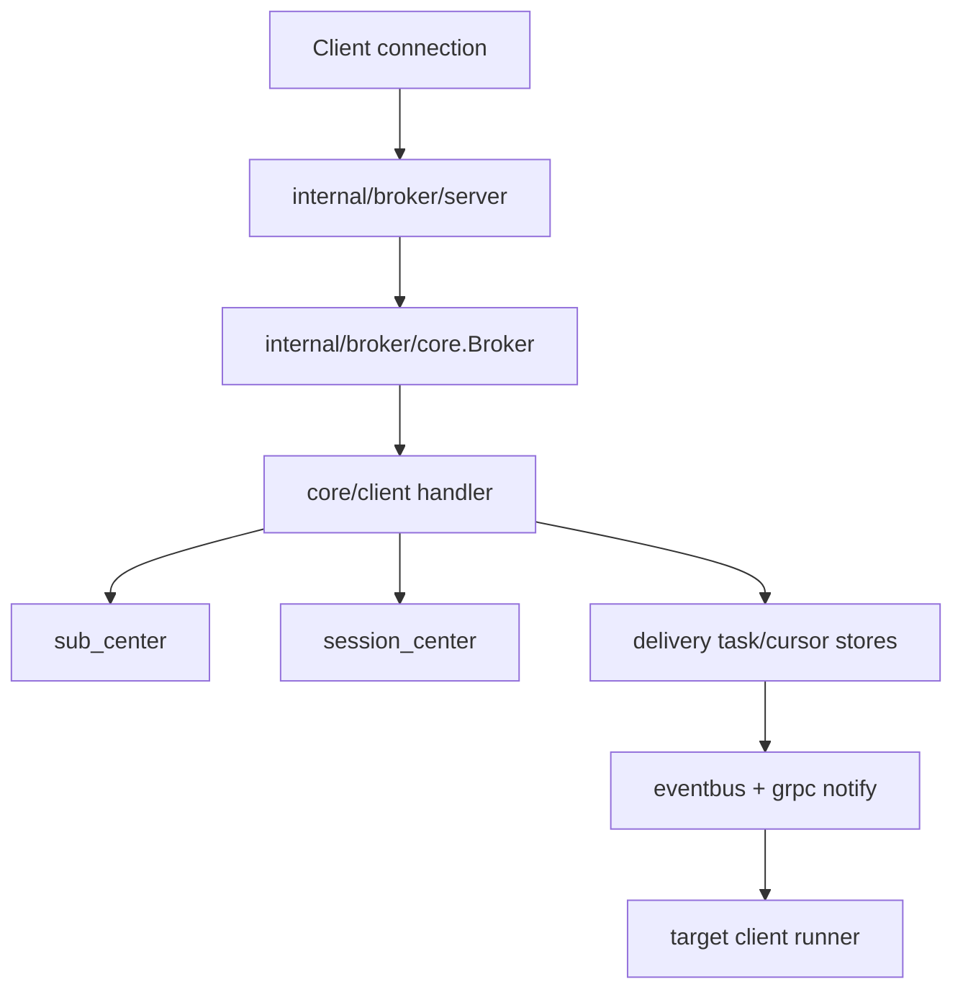

# SkyTree Repo Map

<!-- maintained-by: human+ai -->
<!-- ai-generated-start -->

## 1. Top-Level Directories

| Path | Purpose |
| --- | --- |
| `cmd/` | Binary entrypoint (`main.go`) and process lifecycle bootstrap. |
| `internal/app/` | Dependency wiring, infra initialization, component registration/start/close. |
| `config/` | Runtime config model, validation, YAML/env merge logic. |
| `internal/` | Main business runtime implementation (broker core, delivery, centers, plugins, grpc). |
| `pkg/` | Shared abstractions and infra packages (cluster, persistence contracts, storage backends). |
| `api/` | HTTP management API (health, metrics, pprof, ACL, cluster endpoints). |
| `proto/` | Protobuf definitions and generated contracts used by broker internals. |
| `scripts/` | CI/build/deploy/perf/stress helper scripts. |
| `etc/` | Example runtime config files. |
| `deploy/` | Deployment artifacts: `deploy/k8s/{beta,local,stress,cluster3,standalone}`, Grafana/Prometheus, Docker. |
| `web/` | Web-side resources (if enabled by deployment path). |
| `docs/` | Project handbook (`00-07` guides), `adr/`, `changes/`, `specs/`, MQTT v5 PDF. |

## 2. Entry Points

| Entry | Role |
| --- | --- |
| `cmd/main.go` | Parse flags, load config, create app, start components, handle shutdown signals. |
| `internal/app/NewApp(...)` | Build infra (stores, event bus, grpc client), state centers, broker, API, gRPC server. |
| `internal/app/App.Start()` | Start managed components with readiness model and critical component checks. |
| `api/NewAPI(...).Start(...)` | Start Gin-based HTTP server with optional TLS/mTLS. |
| `internal/grpc/NewServer(...).Start(...)` | Start node-to-node gRPC service with TLS policy enforcement. |

## 3. Critical Cross-Package Contracts

| Contract | Defined In | Main Implementations |
| --- | --- | --- |
| `session.Center` | `pkg/brokerapi/session` | `internal/broker/sessioncenter/{memory,wal,raft}` |
| `subscription.Center` | `pkg/brokerapi/subscription` | `internal/broker/subcenter/{memory,wal,raft}` |
| `KeyStore` | `pkg/brokerapi/persistence` | `pkg/storage/keystore/{badger,redis,raftstore}` |
| `ClientDeliveryStore` | `pkg/brokerapi/persistence` | `pkg/storage/delivery/combined` (metadata+payload composition) |

## 4. Request/Message Path Map

## 5. Where To Edit By Intent

| Intent | Start From |
| --- | --- |
| Add/adjust MQTT packet behavior | `internal/broker/core/client/client_handler.go` |
| Add cluster control behavior | `pkg/cluster/raft` and `internal/cluster/health` |
| Add management API endpoint | `api/api.go` + dedicated handler file |
| Add delivery storage backend | `pkg/storage/delivery/*` + `pkg/storage/delivery/factory/client_delivery.go` |
| Update startup wiring | `internal/app/app.go` and companion `internal/app/load_*.go` files |
| Add config item | `config/*.go` + `config/validate.go` + sample in `etc/` |

## 6. Reading Strategy For AI Tasks

1. Read `00-overview.md`.
2. Identify change category using section 5.
3. Read target package contract in `pkg/brokerapi/*` first, then implementation in `internal/*` or `pkg/storage/*`.
4. Confirm startup wiring in `internal/app/` and config dependency in `config/`.
5. Verify with `Makefile` targets before finalize.

<!-- ai-generated-end -->

<!-- PKB-metadata
last_updated: 2026-05-19
commit: 1cec350
updated_by: human+ai
doc_type: reference
-->
