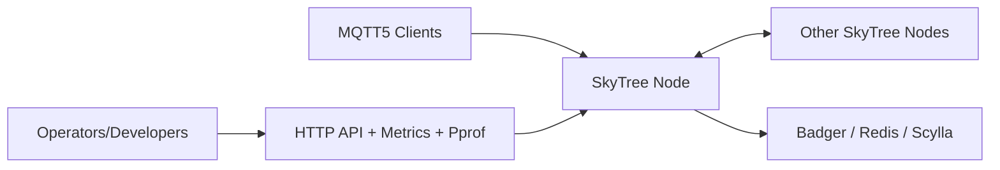
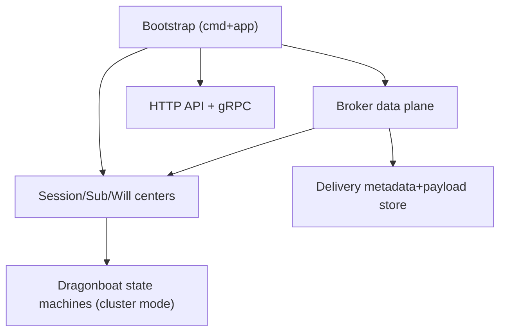
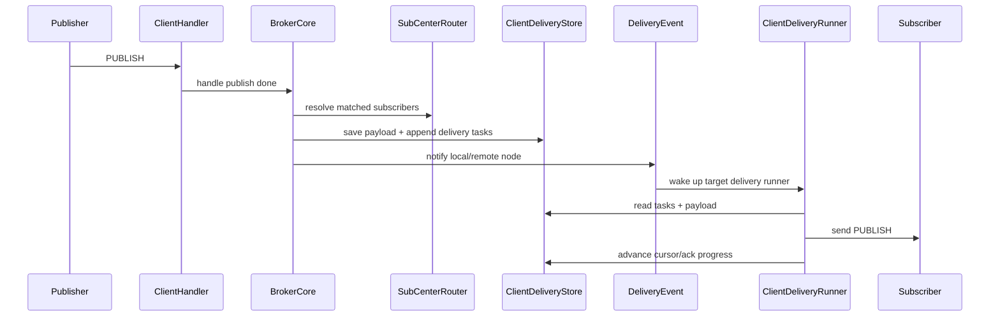

# SkyTree Architecture (C4)

<!-- maintained-by: human+ai -->
<!-- ai-generated-start -->

## 1. Context

SkyTree provides MQTT 5 broker capability for clients, while exposing HTTP API for operators and gRPC for node-to-node coordination.

## 2. Container

Main process containers inside one node:

- **Bootstrap container**: `cmd/main.go` + `app.NewApp`.
- **Data plane container**: `internal/broker/core` + `internal/broker/server` + `internal/broker/delivery`.
- **State container**: session/subscription/will-delay centers.
- **Control plane container**: `api` HTTP server and `internal/grpc` server.
- **Storage container**: key store + client delivery store composition.

## 3. Component

### 3.1 Bootstrap Components

- `config.Load`: YAML + env merge, strict schema check, validation.
- `buildInfra`: cluster, key store, delivery store, event center, grpc clients.
- `buildStateCenters`: select memory / local WAL / raft implementation.
- `registerComponents`: register broker, retry worker, API, gRPC, health checker.

### 3.2 Data Plane Components

- `Broker`: connection accept + publish orchestration.
- `Client Handler`: packet-level MQTT semantics.
- `SubCenterRouter`: resolve subscriber targets.
- `ClientDeliveryRunner`: cursor-based delivery to connected clients.
- `SharedSubscriptionManager`: share-group task dispatch and rollback.

### 3.3 Control Plane Components

- HTTP routes:
  - `/health`
  - `/metrics`
  - `/debug/pprof/*filepath`
  - `/api/v1/acl/*`
  - `/api/v1/cluster/*`
- gRPC services:
  - client delivery notify service
  - client close service

## 4. Code-Level Interaction

## 5. State and Persistence Decision Matrix

| Capability | Single node | Durable single node | Cluster |
| --- | --- | --- | --- |
| Session center | memory | local WAL | raft-backed |
| Subscription center | memory | local WAL | raft-backed |
| Will delay center | memory | local WAL | raft-backed |
| Key store | badger/redis | badger/redis | raftstore |
| Delivery metadata/payload | single_node_badger | single_node_badger | scylla |

## 6. Security and Reliability Notes

- HTTP API TLS/mTLS is optional but validated when enabled.
- Cluster gRPC requires TLS unless `cluster.grpc.allow_insecure=true`.
- `App.Start` tracks critical components with readiness windows to avoid false-positive startup.
- `App.Close` cancels context, closes components in reverse order, then closes resources.

## 7. Architecture Drift Checklist (For Future Changes)

- Is new component added into `registerComponents` and close path?
- Is config validated in `config.Validate` and surfaced in `etc/`?
- Is store pairing still valid under `ResolveClientDeliverySpec`?
- Does cluster mode and single-node mode both have compatible behavior?

<!-- ai-generated-end -->

<!-- PKB-metadata
last_updated: 2026-05-19
commit: 1cec350
updated_by: human+ai
doc_type: explanation,reference
-->
