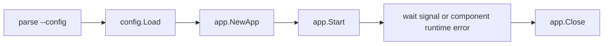
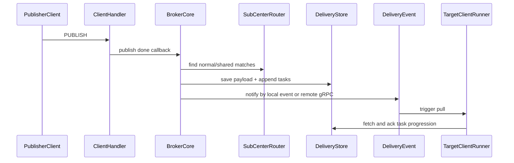

# SkyTree Core Workflows

<!-- maintained-by: human+ai -->
<!-- ai-generated-start -->

## 1. Startup Workflow

### Key checkpoints

- Config must pass strict schema + runtime validation.
- Critical components must pass startup readiness window.
- Runtime errors from components are reported via `RunErrors()`.

## 2. CONNECT / Session Ownership Workflow

1. Client sends `CONNECT`.
2. Handler runs plugin hooks and authentication/ACL related checks.
3. Session center opens/restores session state.
4. Ownership token is taken for fencing old owners.
5. If previous owner is remote, node controller sends remote-close command.
6. New client enters manager and starts delivery runner.

## 3. SUBSCRIBE Workflow

1. Client sends `SUBSCRIBE` packet.
2. Handler validates topic filters and options.
3. Sub center persists/updates subscriber record.
4. Shared subscription entries are grouped by `$share/<group>/...`.
5. Ack is returned to client with granted QoS.

## 4. PUBLISH -> Delivery Workflow

## 5. Shared Subscription Workflow

1. Router aggregates shared matches by group.
2. Shared task is appended to shared-subscription queue.
3. Consumer selects an active member (selector strategy).
4. Shared task is converted to client-specific delivery task.
5. If target member disappears, task can rollback/retry.

## 6. Cluster Health Workflow

1. Health checker periodically probes configured raft groups.
2. Status events are emitted to local event bus.
3. HTTP `/api/v1/cluster/health` and `/api/v1/cluster/overview` expose summaries.
4. Operators can quickly detect unhealthy groups and backlog pressure.

## 7. Shutdown Workflow

1. Process receives SIGINT/SIGTERM/SIGQUIT or component error.
2. Root context is canceled.
3. `App.Close` stops health checker, closes components in reverse order, then closes stores/cluster resources.
4. Graceful timeout guards process exit path.

## 8. Workflow Debug Pointers

| Symptom | First check |
| --- | --- |
| Publish not reaching subscribers | `internal/broker/delivery` task generation and cursor movement |
| Frequent session takeover | owner-token related calls in session/sub centers |
| Cluster notify failures | `internal/grpc` server/client TLS and endpoint config |
| API unavailable | `server.port`, TLS cert paths, and route initialization |

<!-- ai-generated-end -->

<!-- PKB-metadata
last_updated: 2026-05-19
commit: 1cec350
updated_by: human+ai
doc_type: how-to,reference
-->
