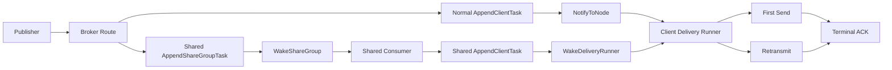

# P1 Delivery Observability

## Summary

本方案为持久化投递链路补齐 5 类 Prometheus 指标：入队延迟、唤醒延迟、首次送达延迟、重传率和 ACK 延迟。指标覆盖普通订阅与 shared 订阅的持久化链路，不覆盖 QoS0 direct 和 retained 下行主口径。

所有指标只使用低基数标签，禁止引入 `client_id`、`topic`、`message_id`、`share_group` 等高基数字段。

## Delivery Flow



## Metrics

### `skytree_delivery_enqueue_delay_seconds`

- Type: Histogram
- Labels: `path`, `qos`, `result`
- Label values:
  - `path`: `normal`, `shared`
  - `qos`: `0`, `1`, `2`
  - `result`: `success`, `duplicate`, `error`
- Meaning: 单次 `AppendClientTask` 调用耗时。
- Instrumentation:
  - Normal: `internal/broker/core/broker_delivery.go`
  - Shared: `internal/broker/sharedsubscription/consumer/consumer.go`

### `skytree_delivery_wake_delay_seconds`

- Type: Histogram
- Labels: `path`, `mode`, `result`
- Label values:
  - `path`: `normal`, `shared`
  - `mode`: `event_local`, `event_remote`, `direct`
  - `result`: `success`, `error`
- Meaning: 投递唤醒动作耗时。
- Instrumentation:
  - Normal `NotifyToNode`: `internal/broker/core/broker_delivery.go`
  - Shared `WakeShareGroup` and `WakeDeliveryRunner`: `internal/broker/core/broker_delivery.go`, `internal/broker/sharedsubscription/consumer/consumer.go`

### `skytree_delivery_first_send_delay_seconds`

- Type: Histogram
- Labels: `path`, `qos`
- Label values:
  - `path`: `normal`, `shared`
  - `qos`: `0`, `1`, `2`
- Meaning: `time.Now() - delivery_task.TS`，在首次成功写出 PUBLISH 后记录。
- Instrumentation: `internal/broker/core/client/delivery_runner.go`

### `skytree_delivery_send_attempts_total`

- Type: Counter
- Labels: `path`, `qos`, `attempt`
- Label values:
  - `path`: `normal`, `shared`
  - `qos`: `0`, `1`, `2`
  - `attempt`: `initial`, `retransmit`
- Meaning: 下行发送尝试次数，用于计算重传率。
- Instrumentation: `internal/broker/core/client/delivery_runner.go`

Retransmit rate:

```promql
sum(rate(skytree_delivery_send_attempts_total{attempt="retransmit"}[5m]))
/
sum(rate(skytree_delivery_send_attempts_total[5m]))
```

### `skytree_delivery_ack_delay_seconds`

- Type: Histogram
- Labels: `path`, `qos`, `result`
- Label values:
  - `path`: `normal`, `shared`
  - `qos`: `1`, `2`
  - `result`: `success`, `negative`
- Meaning: `terminal_ack_time - FirstPubTime`，仅持久化 QoS1/QoS2 下行 inflight 终态 ACK 记录。
- Instrumentation: `internal/broker/core/client/client_handler_qos_flow.go`

## Alert Threshold Draft

- Enqueue delay:
  - Warning: p95 > 0.1s for 10m
  - Critical: p95 > 0.3s for 10m
- Wake delay:
  - Warning: p95 > 0.2s for 10m
  - Critical: p95 > 1s for 10m
- First send delay:
  - Warning: p95 > 1.5s for 10m
  - Critical: p95 > 3s for 10m
- Retransmit rate:
  - Warning: > 2% for 15m
  - Critical: > 5% for 15m
- ACK delay:
  - Warning: p95 > 5s for 10m
  - Critical: p95 > 12s for 10m

## Validation

Run focused tests:

```bash
go test ./pkg/metric
go test ./internal/broker/core -run 'Test.*Delivery|TestWakeClientDeliveryRunners'
go test ./internal/broker/sharedsubscription/consumer
go test ./internal/broker/core/client -run 'TestDeliveryRunner|TestDeliverSingleClientDeliveryTaskRecordsInitialDeliveryMetrics|TestMaybeRetransmitOutgoingInflightRecordsRetransmitMetric|TestHandlePubAck|TestHandlePubRec|TestHandlePubComp|TestReceiveMaximum'
```

Local runtime check:

```bash
curl -s http://127.0.0.1:<port>/metrics | grep 'skytree_delivery_'
```
