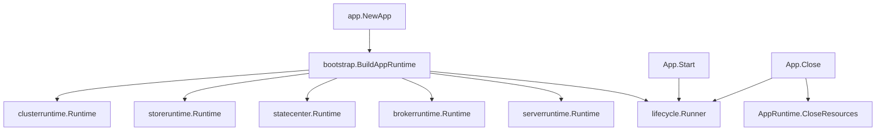
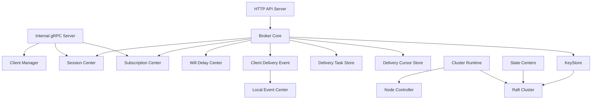

# App 启动结构说明

<!-- maintained-by: human+ai -->

这份文档用于快速理解 `app` 目录的基础设计：启动时用了哪些组件、哪些组件参与 raft 集群、数据分别存储在哪里，以及这些组件如何协同工作。

## 目录职责

`app` 是进程级应用装配层。它不实现 MQTT 协议细节，也不直接实现存储引擎，而是把配置、集群、存储、状态中心、broker core、API/gRPC server 和生命周期管理组合成一个可运行的应用实例。

主要入口：

- `app.NewApp(...)`：构建应用运行时。
- `App.Start()`：启动托管组件。
- `App.Close()`：停止托管组件并释放底层资源。
- `App.RunErrors()`：暴露后台组件运行期错误。

内部包职责：

| 包 | 职责 |
| --- | --- |
| `app/internal/bootstrap` | 按固定顺序构建 `AppRuntime`，并负责构建失败时的 rollback。 |
| `app/internal/lifecycle` | 统一托管组件的 `Start`、ready 判断、运行错误上报和 `Close` 顺序。 |
| `app/internal/clusterruntime` | 构建 raft cluster、raft client、集群状态、健康检查和集群概览 provider。 |
| `app/internal/storeruntime` | 构建 keystore、客户端投递队列存储、投递任务 store、投递 cursor store。 |
| `app/internal/statecenter` | 构建 session、subscription、will-delay 三类状态中心。 |
| `app/internal/brokerruntime` | 构建 `core.Broker` 和 publish retry worker。 |
| `app/internal/serverruntime` | 构建 HTTP API server 和内部 gRPC server 组件。 |

## 启动流程

`BuildAppRuntime` 是应用运行时的装配入口。它按依赖顺序构建组件，避免在单个大结构体里混放所有资源。

### 构建顺序

构建顺序是有严格要求的，因为后面的 runtime 会直接依赖前面 runtime 产出的对象。`bootstrap.BuildAppRuntime` 按下面顺序构建，不能随意调整：

1. 创建本地事件总线 `LocalEvent`。
2. 根据 `cfg.Cluster` 构建 `clusterruntime.Runtime`，集群模式下启动 raft cluster。
3. 构建 `storeruntime.Runtime`，包括 keystore、客户端投递队列和投递任务访问对象。
4. 用 keystore 创建 cluster state、raft gRPC client 和 node controller。
5. 创建本地投递事件中心、client manager 和 client delivery event。
6. 构建 `statecenter.Runtime`，包括 subscription、session、will-delay 三个状态中心。
7. 构建集群健康检查器，并注册健康检查事件日志监听器。
8. 构建 `brokerruntime.Runtime`，创建 broker core；publish retry 由 broker core 内部创建和持有。
9. 构建 `serverruntime.Runtime`，创建 HTTP API server 和内部 gRPC server。
10. 把可运行组件转换为 `lifecycle.ManagedComponent`，交给 `lifecycle.Runner` 托管。

依赖关系说明：

- `storeruntime` 依赖 `clusterruntime.Cluster`，因为集群模式下 keystore 和投递存储可能需要注册或使用 raft 相关能力。
- `clusterruntime.BuildClients` 必须在 keystore 创建后执行，因为 cluster state 需要以 keystore 为底层状态存储。
- `statecenter` 依赖 `clusterruntime.Cluster`，因为集群模式下 session、subscription、will-delay 都要注册 raft state machine。
- `brokerruntime` 依赖 cluster、store、state center、event bus 和 client manager，所有上游 runtime 必须先构建完成。
- `serverruntime` 依赖 broker、cluster health/overview、state center 和 client manager，因此必须在 broker runtime 之后构建。
- `lifecycle.Runner` 只接收已经构建好的 component，因此最后创建。

### 运行期启动顺序

运行期启动也有注册顺序，但不是串行启动模型。`lifecycle.Runner.Start()` 会按 `buildManagedComponents` 返回的顺序启动 goroutine；随后等待所有关键组件 ready。也就是说，组件的“发起启动顺序”是固定的，但各组件真正 ready 的先后不保证。Broker 内部仍有自己的串行启动约束：publish retry 调度器会先于 MQTT server 和 client accept loop 启动。

当前托管组件的注册顺序如下：

| 顺序 | 组件 | 来源 | 是否关键组件 | 说明 |
| --- | --- | --- | --- | --- |
| 1 | Broker core | `brokerruntime.Runtime.BrokerCore` | 是 | MQTT broker 主运行体，内部先启动 publish retry。 |
| 2 | HTTP API server | `serverruntime.Runtime.API` | 是 | 暴露管理、ACL、集群健康和概览接口。 |
| 3 | Internal gRPC server | `serverruntime.Runtime.GRPC` | 是 | 节点间内部调用入口。 |
| 4 | Raft gRPC client | `clusterruntime.Runtime.RaftGRPCClient` | 否 | 用于节点间 raft 相关请求转发。 |

关键组件启动失败会导致 `App.Start()` 返回错误，并触发已启动资源关闭。非关键组件异常退出会通过 `App.RunErrors()` 上报。

关闭顺序与注册顺序相反：先关闭后注册的组件，再关闭先注册的组件。这样 server/client 类组件会先停止，broker core 最后停止，减少关闭阶段继续接收新请求的机会。

## 组件关系

核心协作方式：

- `bootstrap` 只负责装配，不负责业务实现。
- `brokerruntime` 把 storage、state center、cluster node controller、event bus 注入 `core.Broker`。
- `serverruntime` 只构建对外和对内 server，不决定启动策略。
- `lifecycle` 只管理组件生命周期，不依赖 broker、API、gRPC 或 raft 业务包。
- `clusterruntime` 是所有 raft 相关 helper 的归属包，避免状态中心或 API 概览代码自己散落 raft 构建逻辑。

## 哪些组件使用 raft 集群

是否使用 raft 由 `cfg.Cluster.Enable` 决定。单机模式下，状态中心使用本地 WAL；集群模式下，对应状态中心注册 raft state machine，并通过 raft client 读写。

| 数据/组件 | raft cluster id | 单机模式 | 集群模式 |
| --- | --- | --- | --- |
| KeyStore | `raft.ClusterIDKeyStore` | Badger 或 Redis，由 `storage.driver` 决定。 | 本地 Badger 承载 state machine，业务访问走 `raftstore.NewKeyStoreCluster(...)`。 |
| Subscription Center | `raft.ClusterIDSubCenter` | `internal/broker/subcenter/wal`，目录为 `broker.local_state.data_dir/sub_center`。 | 注册 subscription state machine，业务访问走 `internal/broker/subcenter/raft`。 |
| Session Center | `raft.ClusterIDSessionCenter` | `internal/broker/sessioncenter/wal`，目录为 `broker.local_state.data_dir/session_center`。 | 注册 session state machine，业务访问走 `internal/broker/sessioncenter/raft`。 |
| Will Delay Center | `raft.ClusterIDWillDelayCenter` | `internal/broker/willdelay/wal`，目录为 `broker.local_state.data_dir/will_delay_center`。 | 注册 will-delay state machine，业务访问走 `internal/broker/willdelay/raft`。 |

不直接使用 raft 的组件：

- HTTP API server：通过注入的 health checker、overview provider 和 broker ACL manager 读取状态。
- Internal gRPC server：处理节点间请求，但本身不是 raft state machine。
- Client delivery queue store：由 `storage.delivery_queue.driver` 和 `storage.payload.driver` 决定，目前支持 `single_node_badger` 和 `scylla` 配对，不通过本 app 的 raft state machine 存储。
- Publish retry：Broker core 内部的内存调度器，不持久化任务，不直接注册 raft group。

## 数据存储位置

### KeyStore

KeyStore 是 broker 的通用 KV 状态存储，供 retain、ACL fallback、集群状态等逻辑使用。

配置入口：

- `storage.driver`
- `storage.badger.path`
- `storage.redis`

存储位置：

| 模式 | driver | 存储位置 |
| --- | --- | --- |
| 单机 | `badger` | `storage.badger.path/<local_node_id>` |
| 单机 | `redis` | `storage.redis.address` 指向的 Redis |
| 集群 | 固定本地 Badger + raft | 本地 state machine 存在 `storage.badger.path/<local_node_id>`，业务读写通过 raft group 复制 |

### 状态中心

状态中心保存 MQTT broker 的核心运行状态。

配置入口：

- `broker.local_state.data_dir`
- `broker.local_state.snapshot_interval`
- `broker.local_state.snapshot_entries`
- `cluster.enable`

单机模式本地目录：

| 状态中心 | 目录 |
| --- | --- |
| Subscription Center | `broker.local_state.data_dir/sub_center` |
| Session Center | `broker.local_state.data_dir/session_center` |
| Will Delay Center | `broker.local_state.data_dir/will_delay_center` |

集群模式下，这三类状态不再以单机 WAL 作为业务入口，而是注册到 raft cluster 中，由对应 raft state machine 复制。

### 客户端投递数据

客户端投递数据拆为两类：

- delivery queue metadata：任务、cursor、共享订阅元数据。
- payload：消息 payload 数据。

配置入口：

- `storage.delivery_queue.driver`
- `storage.payload.driver`

支持配对：

| queue driver | payload driver | 使用场景 | 存储位置 |
| --- | --- | --- | --- |
| `single_node_badger` | `single_node_badger` | 单机模式 | 本地 Badger，具体目录由 delivery store factory 根据 storage 配置创建 |
| `scylla` | `scylla` | 单机或集群模式 | Scylla/Cassandra 兼容后端 |

注意：

- `single_node_badger` 只允许在 `cluster.enable=false` 时使用。
- queue 和 payload driver 必须一致，不支持混用。
- `storeruntime.Build` 会基于 `ClientDeliveryStore` 创建 `DeliveryTaskStore` 和 `DeliveryCursorStore`，并执行 schema ensure。

## 事件与健康检查

本地事件相关组件：

- `LocalEvent`：基于 `go-events` 的本地事件总线。
- `LocalEventCenter[*delivery_event.Notify]`：用于客户端投递通知。
- `ClientDeliveryEvent`：把投递事件发送到本地事件中心，并结合 node controller 做节点通知。

健康检查：

- `clusterruntime.BuildHealthChecker` 只在集群模式且 health check 配置启用时创建。
- health checker 使用 raft cluster 已启动的 cluster id 列表作为检查对象。
- 健康检查成功、失败和恢复事件会注册到 `LocalEvent`，用于输出结构化日志。
- HTTP API 的集群健康和概览能力通过 `serverruntime` 注入到 API component。

## 关闭顺序

关闭由 `App.Close()` 统一触发：

1. 取消 App context。
2. 停止 health checker。
3. 调用 `lifecycle.Runner.Close()`，按组件注册顺序反向关闭 broker、worker、server 和 raft gRPC client。
4. 调用 `AppRuntime.CloseResources()`，反向关闭底层资源，例如 client delivery store、keystore、raft cluster。

构建阶段失败时，`bootstrap.rollbackStack` 会关闭已经创建的资源，避免半初始化资源泄漏。

## 快速阅读路径

建议按以下顺序阅读代码：

1. `app/app.go`：理解 `NewApp` 如何进入 app runtime 构建。
2. `app/internal/bootstrap/app_builder.go`：理解启动装配顺序。
3. `app/internal/bootstrap/app_runtime.go`：理解 App 持有哪些 runtime。
4. `app/internal/lifecycle/runner.go`：理解组件如何启动、ready 和关闭。
5. `app/internal/storeruntime/runtime.go`：理解存储依赖如何构建。
6. `app/internal/statecenter/mode_builder.go`：理解单机 WAL 与 raft 模式如何切换。
7. `app/internal/brokerruntime/runtime.go`：理解 broker core 依赖如何注入。
8. `app/internal/serverruntime/runtime.go`：理解 API/gRPC server 如何接入 broker 和 cluster 状态。

---

<!-- PKB-metadata
last_updated: 2026-06-15
commit: workspace
updated_by: human+ai
doc_type: reference,explanation
-->
