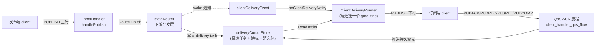
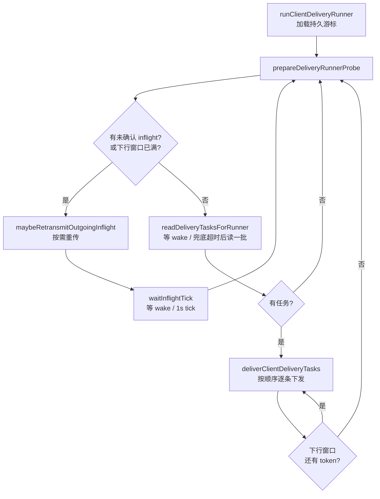
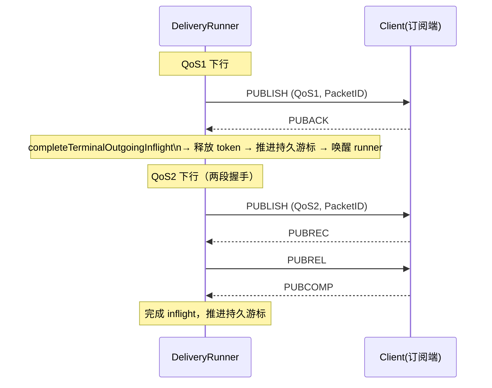
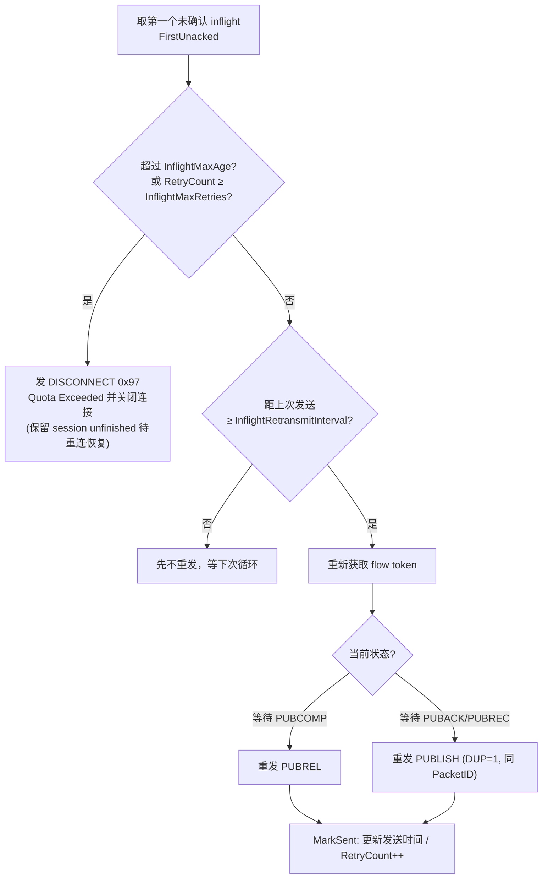
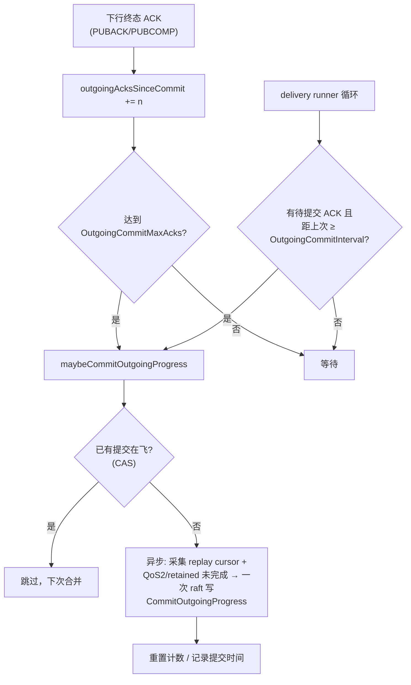
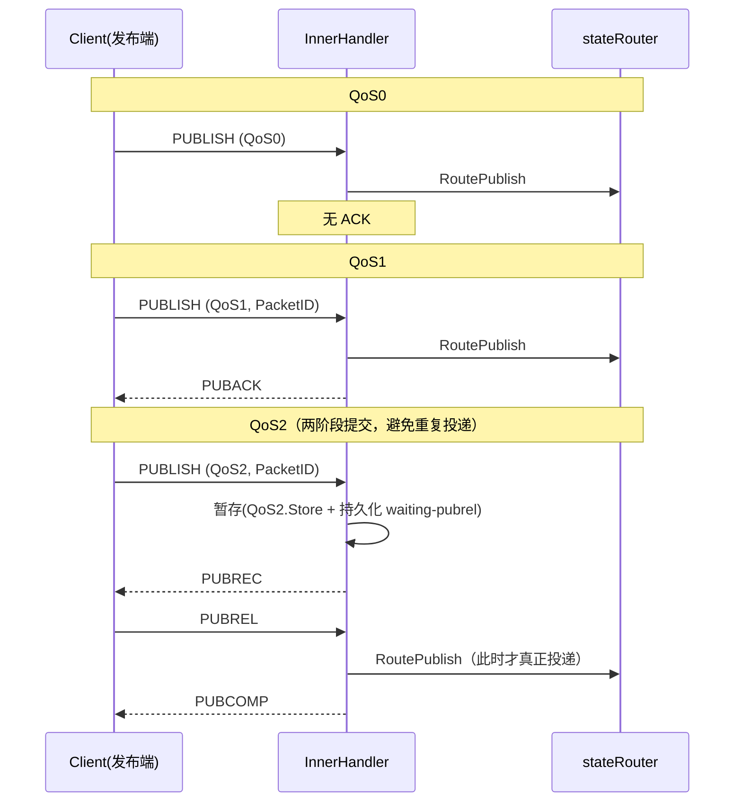

# core/client 目录说明

## 目录职责
- 实现单个 MQTT 连接的完整协议状态机和连接生命周期。
- 负责 CONNECT/订阅/发布/QoS 流程、会话恢复、inflight 管理、下行投递 runner。

## 关键代码
- `client.go`：`Client` 运行时状态（认证、会话、限流、topic alias、inflight）。
- `client_handler.go`：入站控制包统一入口与分发（`HandlePacket` → `dispatchInboundPacket`）。
- `client_handler_publish.go`：客户端上行 PUBLISH 处理（上行链路）。
- `client_handler_qos_flow.go`：PUBACK/PUBREC/PUBREL/PUBCOMP 等 QoS 握手与 ACK 驱动游标推进。
- `client_lifecycle.go`：连接关闭、会话持久化、遗嘱处理。
- `delivery_runner.go`：从 delivery task 队列拉取并下发给客户端（下行链路）。
- `outgoing_inflight*.go`：下行 QoS1/QoS2 inflight 与 ACK 驱动游标推进、会话恢复重传。

## 阅读建议
1. 从 `handleConnect` 进入，顺到 `StartClientDeliveryRunner`。
2. 再看 `handlePublish`、`handleSub` 和 QoS ACK 流程。

---

# 消息流转（Deliver）说明

本节说明两个方向的消息流转：**下行投递**（broker → client，把订阅到的消息发给当前客户端）和**上行接收**（client → broker，处理客户端发来的 PUBLISH）。两者通过 `stateRouter` 与下游投递层衔接。

## 一、角色与组件

要点：

- 每个在线客户端都有一个独立的下行 runner goroutine（`runClientDeliveryRunner`），它是**事件驱动**的，没有按客户端轮询。
- 上行 PUBLISH 经 `RoutePublish` 进入下游分发层，转化为各订阅端的 delivery task；订阅端的 runner 再把任务拉出来下发。
- `deliveryCursorStore` 同时保存投递任务、消息体和每个客户端的投递游标（cursor）。

---

## 二、下行投递（broker → client）

### 2.1 runner 如何被触发

下行投递完全由 `delivery_runner.go` 中的 runner 驱动。它在以下时机被触发：

1. **连接建立后启动**：`StartClientDeliveryRunner` 注册 per-client 投递事件监听，并 `go runClientDeliveryRunner()`。启动时先做一次初始 probe（`alignDeliveryCursorBeforeRunner`）把游标对齐到已恢复的 inflight。
2. **有新消息时唤醒**：发布链路通过 `clientDeliveryEvent` 发 `KindWake` 通知 → `onClientDeliveryNotify` → 向 `deliveryWakeCh` 投递信号，唤醒 runner 立即重读 store。
3. **兜底定时**：即使没有 wake，runner 也会在 `WakeMaxWait`（默认 3m）超时后做一次 probe；当存在未确认 inflight 时改用更短的 `InflightWaitTick`（默认 1s）周期检查。
4. **QoS0 直发**：`KindQoS0Direct` 通知直接把 PUBLISH 写到 socket（`handleQoS0DirectNotify`），**不进 runner、不持久化、不重试**。

### 2.2 runner 主循环

- **下行窗口（Receive Maximum）**：由协商出的下行窗口控制（`canSendMoreDownlink` / `publishBucket` token）。窗口满时 runner 不再发新消息，转而等待 ACK 释放 token。
- 一批任务里任意一条写失败，会 backoff 后中断本批、稍后重试（`deliverClientDeliveryTasks`）。

### 2.3 单条消息的下发与 QoS 握手

`deliverSingleClientDeliveryTask` 负责单条任务：读消息体 → 解码 → 过期/载荷格式校验 → 设置 QoS → 分配 PacketID → 占用 flow token → 注册 `outgoingInflight` → 写 PUBLISH。

游标推进规则（很重要）：

- **QoS0**：写完立即推进游标（无 ACK）。
- **QoS1/QoS2**：发送后只推进**内存游标**，防止 runner 在 ACK 到达前重复读取重发；**持久游标只在收到终态 ACK（PUBACK / PUBCOMP）后才推进**（`advanceAckedOutgoingInflight`）。这样即使进程崩溃，未确认的消息也不会被跳过。
- 负向 reason code（≥ 0x80 的 PUBACK/PUBREC/PUBCOMP）视为**终态失败**，同样完成 inflight 并推进游标，不再重发。

### 2.4 什么情况下会重试（重传）

重传逻辑在 `maybeRetransmitOutgoingInflight`，由 runner 主循环在「有未确认 inflight」或「下行窗口已满」时调用：

触发与约束条件：

- **触发时机**：客户端迟迟不回 ACK 时，runner 周期性（wake 或 `InflightWaitTick`≈1s）进来检查。
- **重传间隔**：距上次发送时间需超过 `InflightRetransmitInterval`（默认 5s）才真正重发。
- **重传内容**：QoS2 处于等待 PUBCOMP 阶段重发 **PUBREL**；其余（等待 PUBACK/PUBREC）重发带 `DUP=1`、相同 PacketID 的 **PUBLISH**。
- **终止条件**：超过 `InflightMaxAge`（默认 2m）或 `InflightMaxRetries`（默认 5 次）→ 按 MQTT5 §4.13 发 `0x97 Quota Exceeded` DISCONNECT 并关闭连接，**保留** session 中的未完成 inflight，等客户端重连后恢复。
- **报文过大**：若重协商后的 Maximum Packet Size 已容不下原报文，等同「投递成功（被丢弃）」，清掉 inflight 并释放 token，避免游标被卡住。

### 2.5 重连恢复

当 `CleanStart=false` 且 `SessionPresent=true` 重连时（`outgoing_inflight_restore.go`）：

- 从 session 恢复尚未完成的 outgoing inflight（QoS2 / retained-QoS1），并按状态重发 PUBLISH 或 PUBREL；普通 QoS1 通过 **replay cursor** 从游标位置重放。
- 这些被恢复的 inflight 条目标记为 `PersistedInSession=true`，因此它们被 ACK 后才会发 session 的 `RemoveOutgoingUnfinished` 清理；在线期间新发送、同会话内确认的消息则不会逐条写/删 session（详见下文优化说明）。

### 2.6 下行进度的周期性提交（防意外宕机重放）

QoS1 重放游标（`OutgoingReplayCursor`）和 QoS2/retained 的未完成 inflight 列表，默认只在**优雅断开**时通过 `SaveOfflineState` 写入 session（raft）。一旦进程**意外宕机**（`close()` 没机会执行），session 里的进度就是陈旧的，重连后可能从很早的位置重放，造成瞬时洪峰。

为此引入**在线期间的周期性进度提交**（`outgoing_progress_commit.go` 的 `commitOutgoingProgressToSession`），把同一份进度按规则提前固化到 session：

- **触发规则（任一先满足即提交）**：自上次提交起累计的下行终态 ACK（QoS1 PUBACK / QoS2 PUBCOMP）达到 `OutgoingCommitMaxAcks`（默认 500）；或距上次提交超过 `OutgoingCommitInterval`（默认 5s）。计数在 `advanceAckedOutgoingInflight` 里累加，时间维度在 delivery runner 循环里检查（空闲时会把等待上限收敛到提交间隔，保证按时提交）。
- **覆盖两种 QoS**：QoS1 提交重放游标（按位置重放）；QoS2/retained 提交在飞的未完成条目（带 PacketID 和握手阶段，恢复时按阶段精确重传，保持精确一次）。在飞条目数受下行 Receive Maximum 窗口限制，所以单次提交负载很小。
- **专用的轻量 raft 写**：走 `CHECKPOINT/COMMIT_OUTGOING_PROGRESS`（`CommitOutgoingProgress`），只更新出站进度，**不触碰**遗嘱、会话过期、上行未完成消息或所有者在线状态——区别于带下线副作用的 `SaveOfflineState`。
- **异步、去抖、防僵尸**：提交在独立 goroutine 中执行，不阻塞 ACK 主路径；`outgoingCommitInFlight` 原子标志保证同一时刻只有一个提交在写；无新增 ACK 时跳过；写请求带 `OwnerToken`，被接管的旧连接无法覆盖新 owner 的进度。

效果：意外宕机后的重放窗口被压缩到「一个提交周期（≤5s 或 ≤500 条 ACK）」，而不是「整个会话」。`0` 可分别关闭时间/条数维度（退化回仅断开时提交）。

---

## 三、上行接收（client → broker）

客户端发来的 PUBLISH 由 `handlePublish` 处理，主要步骤：Topic Alias 解析 → topic/属性校验 → ACL/插件钩子 → 服务端能力（Max QoS / Retain）校验 → 上行限流 → Receive Maximum 配额 → retained 存储 → 按 QoS 构造应答 → `RoutePublish` 投递到下游 → 回写 ACK。

关键点：

- **QoS0**：直接 `RoutePublish`，无任何 ACK。
- **QoS1**：先 `RoutePublish` 再回 **PUBACK**；若无匹配订阅者，PUBACK 携带 `No Matching Subscribers` reason code。
- **QoS2**：收到首阶段 PUBLISH 时**只暂存不投递**（`storeQoS2Publish`，并持久化「等待 PUBREL」状态），回 **PUBREC**；只有收到 **PUBREL** 才真正 `RoutePublish` 并回 **PUBCOMP**。这种两阶段提交确保「恰好一次」语义，避免客户端重发首阶段 PUBLISH 造成下游重复投递。
- **重复上行**：QoS2 收到 PacketID 已暂存的重复 PUBLISH，直接重发对应 PUBREC（`handleRepeatedPublish`），不重复投递。
- **流控/保护**：上行受 `incomingPublishRateLimiter` 限速、受服务端 `Receive Maximum` 配额限制（`trackIncomingPublishQuota`）；越界、topic 非法、能力不支持、载荷格式非法等会按协议回 DISCONNECT 或带错误 reason code 的 ACK。

---

## 四、关键配置项（`config.DeliveryRunner`）

| 配置 | 默认值 | 含义 |
|------|--------|------|
| `WakeMaxWait` | 3m | 无 wake 时的兜底 probe 等待上限 |
| `InflightWaitTick` | 1s | 存在未确认 inflight 时的安全 tick |
| `InflightRetransmitInterval` | 5s | 两次重传之间的最小间隔 |
| `InflightMaxRetries` | 5 | 重传次数上限，超过则断开 |
| `InflightMaxAge` | 2m | inflight 自首次发送起的最大存活时长，超过则断开 |
| `OutgoingCommitInterval` | 5s | 两次下行进度提交之间的最大时间间隔（时间维度触发），`0` 关闭 |
| `OutgoingCommitMaxAcks` | 500 | 累计多少条下行终态 ACK 后提交一次进度（条数维度触发），`0` 关闭 |

---

## 五、设计小结

- **下行**：事件驱动 runner + Receive Maximum 窗口 + 内存游标（防重读）/ 持久游标（仅 ACK 后推进，保证不丢不跳），重传由间隔与上限约束，超限以 `0x97` 断开并保留会话待恢复。
- **防宕机重放**：下行进度（QoS1 重放游标 + QoS2/retained 未完成）在线期间按「每 5s 或每 500 条 ACK」周期性提交到 session，把意外宕机后的重放窗口限制在一个提交周期内。
- **上行**：QoS1 收发即应答，QoS2 两阶段提交确保恰好一次，配合限流与配额保护。
- **会话恢复**：重连时恢复未完成的 inflight 并重传，配合 replay cursor 保证下行连续性。
