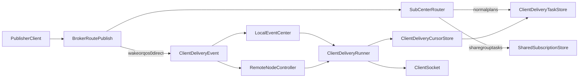
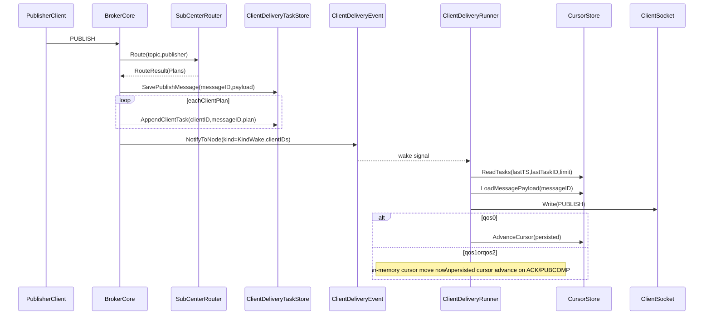
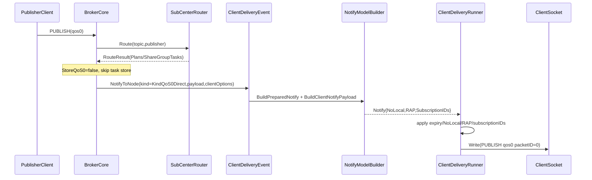
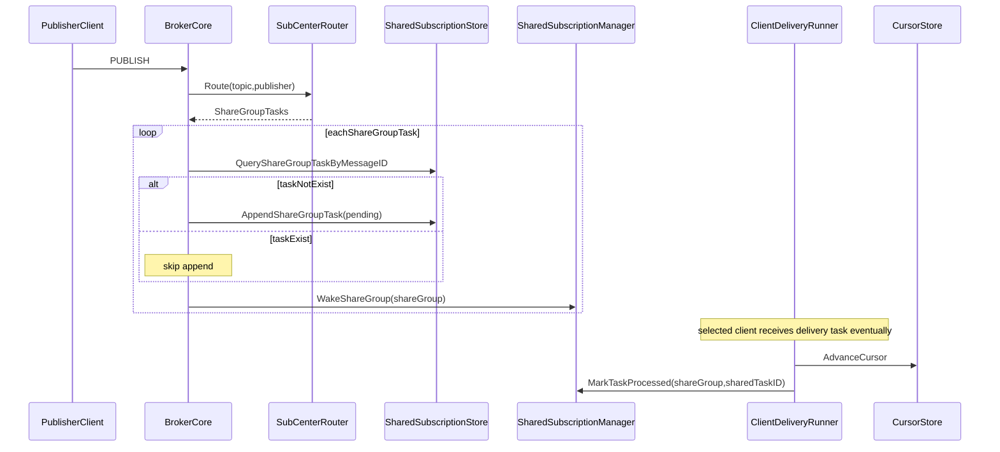

# delivery 运作原理

本文档说明 `internal/broker/delivery` 在 broker 中承担的职责、核心抽象、执行链路与故障语义。  
delivery 的设计目标是把“谁该收消息”和“怎么可靠投递消息”解耦，形成稳定的客户端投递流水线。

## 设计目标与边界

### 设计目标
- 将发布处理拆为四段：`路由` -> `任务化` -> `通知唤醒` -> `runner 消费`。
- 支持普通订阅和共享订阅的统一路由入口、分支处理策略。
- 对在线客户端优先事件驱动（Wake 触发），避免高频轮询。
- 在 QoS0 场景支持免存储直发（受 `StoreQoS0` 控制）。

### 功能边界
- `delivery` 负责投递任务的构建、存储抽象、通知桥接与游标读写。
- 具体的发布编排入口在 `internal/broker/core/broker_delivery*.go`。
- 具体 socket 写入、ACK 驱动、重传逻辑在 `internal/broker/core/client/delivery_runner.go`。

## 目录与核心代码

- `types.go`：定义 `ClientPlan`、`ShareGroupTask`、`RouteResult` 以及 `Router/TaskStore/CursorStore` 接口。
- `router_subcenter.go`：从 `sub_center` 匹配结果构建普通投递计划与共享组任务。
- `store_client_delivery.go`：落库 message payload、追加 client delivery task。
- `cursor_client_delivery.go`：读取任务、加载 payload、推进 delivery cursor。
- `delivery_wrapper.go`：封装底层 `ClientDeliveryStore`，统一超时和序列化行为。
- `event/types.go`：通知类型 `KindWake/KindQoS0Direct` 与通知载体 `Notify`。
- `notify/client_delivery_event.go`：本地 EventCenter 与跨节点 NodeController 的通知桥接。
- `notify/model.go`：构建通知 payload，按客户端附加 NoLocal/RAP/SubscriptionIDs。

## 核心抽象与数据模型

### 路由结果模型
- `ClientPlan`：面向单客户端的投递计划，包含 `DeliveryQoS`、`WinnerNoLocal`、`WinnerRAP`、`SubscriptionIDsJSON`，共享路径下还会带 `ShareGroup/SharedTaskID`。
- `ShareGroupTask`：面向共享订阅组的待分配任务，描述 `shareGroup + topicFilter` 粒度的投递意图。
- `RouteResult`：同时返回普通客户端计划 `Plans` 和共享组计划 `ShareGroupTasks`。

### 存储模型（逻辑角色）
- `message_payload`：消息体只存一次，通过 `messageID` 被多个投递任务引用。
- `delivery_task`：客户端投递任务队列（含 QoS、订阅选项、共享任务标识等）。
- `delivery_cursor`：每个客户端的消费位点（`lastTS + lastTaskID`），保障顺序推进。

### 设计收益
- 消息体去重存储，降低重复写放大。
- 任务与游标分离，支持断连恢复与增量消费。
- 共享订阅可单独演进调度策略，不影响普通路径。

## 架构图

说明：
- 持久化链路：`router -> normalStore/sharedStore -> wake -> runner -> cursorStore`。
- QoS0 直发链路：`router -> eventBridge(kind=qos0direct) -> runner -> socket`，可绕过 task 存储。

## 主流程说明

### 1) 路由阶段（Route）
- 入口：`SubCenterRouter.Route(...)`。
- 调用 `GetAllMatchClientV2(topic)` 拉取匹配结果。
- 将匹配拆成两类：
  - 普通订阅：生成每客户端一个 `ClientPlan`。
  - 共享订阅：按 `(shareGroup, actualTopicFilter)` 聚合为 `ShareGroupTask`。
- 对发布者本人应用 `NoLocal` 过滤，避免本地回环投递。

### 2) 任务化阶段（Store）
- 普通/共享都存在路由时，先调用 `SavePublishMessage` 存一次 payload。
- 普通路径：
  - 为每个 `ClientPlan` 追加 `delivery_task`（支持去重判断 inserted）。
- 共享路径：
  - 将 `ShareGroupTask` 转为共享任务落库，若同消息任务已存在则只唤醒不重复写。

### 3) 通知阶段（Wake / Direct）
- 普通持久化路径：按在线 owner node 分组，发送 `KindWake` 通知唤醒 runner。
- QoS0 且 `StoreQoS0=false`：
  - 不写 task，编码消息为 `KindQoS0Direct` payload。
  - 按客户端在线归属节点发通知，本地走 EventCenter，远端走 NodeController gRPC。
  - 共享 QoS0 会先选候选 client，再定向通知单个目标。

### 4) 消费阶段（Runner）
- 客户端连接后注册监听并启动 `runClientDeliveryRunner()`。
- runner 在 wake 或定时 fallback 下读取 `delivery_task` 批次。
- 每条任务处理：`LoadMessagePayload -> decode -> 应用订阅选项 -> Write(socket)`。
- QoS0 写成功后立即推进持久游标；QoS1/2 写成功先推进内存位点，持久游标在 ACK/PUBCOMP 阶段推进。

## 时序图

### 时序图 A：普通订阅持久化投递

### 时序图 B：QoS0 免存储直发

### 时序图 C：共享订阅任务路径

## 关键规则与异常语义

## 不同 QoS 的客户端投递行为与边界

本节聚焦“broker 下行到客户端”的行为，不讨论客户端上行 publish 处理细节。

### QoS0（At most once）

#### 支持的行为
- 支持普通订阅与共享订阅下发。
- 在 `StoreQoS0=true` 时，走“持久化任务 + runner 消费”路径，与 QoS1/2 共用 task/cursor 主流程。
- 在 `StoreQoS0=false` 时，走 `KindQoS0Direct` 事件直发路径，不写 `delivery_task`。
- 支持 MQTT5 选项下发：`NoLocal`、`RAP`、`SubscriptionIDs`。
- 支持 message expiry 校验，过期消息直接跳过。

#### 边界与不支持
- `StoreQoS0=false` 场景不保证离线补投（当时不可达的目标客户端不会后补）。
- QoS0 不走 ACK 握手，不提供 QoS1/2 级别的重传保障。
- 共享 QoS0 直发只选择“当前在线候选”目标，不提供持久排队兜底。

### QoS1（At least once）

#### 支持的行为
- 下发后等待 `PUBACK`，收到 ACK 才把对应任务作为终态完成并推进持久游标。
- 若 ACK 未到，runner 会按 `InflightRetransmitInterval` 重传同一 packet（保持同一 packetID 语义）。
- 支持 inflight 限流窗口（Receive Maximum）与 backpressure。
- 客户端断线时可把 unfinished inflight 存入 session，重连后恢复流程。

#### 边界与不支持
- 非共享订阅不会把“同一条 QoS1 下行 inflight”切换给别的客户端代 ACK（协议语义不允许）。
- 若长期不 ACK，超过 `InflightMaxRetries` 或 `InflightMaxAge` 会主动断开该客户端连接，再等待其重连恢复。
- 不保证“全局 exactly-once”；QoS1 允许重复投递，业务侧需幂等。

### QoS2（Exactly once，点对点会话语义）

#### 支持的行为
- 支持完整下行握手：`PUBLISH(QoS2)` -> `PUBREC` -> `PUBREL` -> `PUBCOMP`。
- 在 `WAITING_PUBREC/WAITING_PUBCOMP` 阶段支持重传（`PUBLISH DUP` 或 `PUBREL` 重发）。
- 只有在终态确认后才完成 inflight 与游标推进。
- 与 QoS1 一样支持断线 unfinished 持久化与重连恢复。

#### 边界与不支持
- 非共享订阅不会把等待 `PUBREC/PUBCOMP` 的 inflight 转移到其他客户端。
- 若长期不完成握手，行为同 QoS1：重传到阈值后断开连接，等待同一 client session 恢复。
- “Exactly once”是 MQTT 会话级，不是跨客户端迁移级。

### 共享订阅（`$share`）下 QoS 差异

#### 支持的行为
- 共享任务先入共享任务队列（pending），由共享 consumer 选择在线候选成员，并转成目标 client 的 delivery task。
- 若目标成员离线，支持 rollback/requeue，再次挑选在线候选。
- 处理完成后显式 `MarkTaskProcessed`，保证共享任务状态闭环。

#### 边界与不支持
- 共享语义是“同组一条消息只给一个成员”，不是“广播给全组”。
- 已进入某个 client inflight 的 QoS1/2 仍受 MQTT 会话约束，不能直接跨 client 接力 ACK。
- 当 `StoreQoS0=false` 且走共享 QoS0 直发时，不具备完整持久化补偿能力。

### 快速结论（支持矩阵）

| 场景 | 是否支持离线补投 | 是否依赖 ACK | 是否可能切换到其他客户端 |
| --- | --- | --- | --- |
| 普通订阅 QoS0 + `StoreQoS0=false` | 否 | 否 | 否 |
| 普通订阅 QoS0 + `StoreQoS0=true` | 可恢复任务消费 | 否 | 否 |
| 普通订阅 QoS1/2 | 支持同 client 恢复 | 是 | 否 |
| 共享订阅 QoS1/2（任务阶段） | 是（可回滚再分配） | 是（最终对选中 client） | 在任务阶段可重选 |
| 共享订阅 QoS0 + `StoreQoS0=false` | 否（在线直发） | 否 | 当次可重选在线候选 |

### 订阅 winner 选择规则
普通订阅与共享聚合 winner 都遵循同一优先级：
1. QoS 更高优先。
2. 通配符更少优先（更具体）。
3. TopicFilter 层级更深优先。
4. 过滤器字典序更小优先（稳定 tie-break）。

### MQTT5 选项附加
- `NoLocal`：发布者与订阅者同 client 且该订阅配置 `NoLocal=true` 时跳过。
- `RAP`：若 `RetainAsPublished=false`，投递时强制 `retain=false`。
- `SubscriptionIDs`：从匹配订阅收集并附加到下行 publish 属性中。

### Expiry 语义
- 入库时将 `MessageExpiry`（剩余秒）转换为绝对过期时间 `ExpiredTime`。
- 投递前再次执行过期校验；过期消息会跳过并推进游标，避免阻塞队列。

### 游标与 ACK 语义
- QoS0：写成功即推进持久游标。
- QoS1/2：写成功先推进内存位点，持久游标等待 ACK/PUBCOMP，再最终确认。
- 设计目的是避免 ACK 到来前 runner 重复读取同一 task。

### 异常处理要点
- `LoadMessagePayload` not found/empty：记录告警并推进游标跳过坏任务。
- decode 失败：返回错误，batch 在该点停住并退避重试。
- socket 写失败：
  - 普通错误：释放 inflight/token，等待后续重试。
  - oversized outbound：按策略跳过并推进游标，避免永久卡死。
- wake 后读任务失败：仅在 wake 触发失败场景执行有限退避重读，控制 DB 压力。

## 排障建议

### 现象：客户端在线但一直收不到消息
- 先看是否有 `KindWake`/`KindQoS0Direct` 通知被发出（`notify/client_delivery_event.go`）。
- 再看 owner node 解析是否命中在线节点（`resolveOnlineOwnerNodes`）。

### 现象：被唤醒但 runner 长期读不到任务
- 检查 `AppendClientTask` 是否插入成功、是否被判定 duplicate。
- 检查游标是否已前移超过新任务位点。

### 现象：共享订阅消息堆积
- 检查共享任务是否反复命中“已存在”分支但未被处理完成。
- 检查共享候选是否为空（在线成员、NoLocal、topicFilter 匹配）。

### 现象：QoS1/2 发送后重复或停滞
- 关注 inflight window、packetID 分配、ACK 处理是否推进持久游标。
- 检查是否触发重传上限或 inflight 超龄断开保护。
